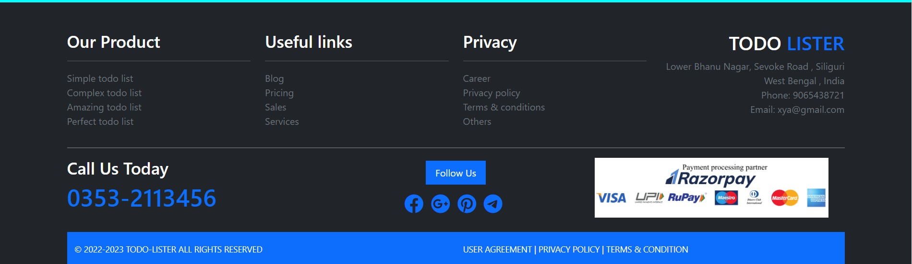

## 1. Project
**The Project is based to create a responsive user personalized Todo List**. 
***
## 2. About 
_This is a user friendly website where the user can save his/her tasks in her personalized todo list . The name of the website is TODO Lister. 
In this Project, we have tried to make our own ToDo List website with our own point of view of design. We have used HTML, CSS , MySQL and simple Javascript in this project._
***
## 3. What you have to do :grey_question:
    - Make the home page (index.php)
    - Make the about page
    - Make a contact page
    - Make a login page
    - Make a signup page
    - Make a page to display the ToDo List of your task.
    - Use php and MySQL in the Backend to perform user authentication.
    - Make a page to add new task. 
    - Use javascript to perform the filtration of the task.
***
## 4. Description
* A `TODO Lister` is a user friendly website where the new user can make their own account to save their task in personalized todo lists. 
- Here, the user can also `update the the Date of deadline and add or remove task` in their personalized todo lists. 
***
## 5. Technology Stack Used :ledger:
- **Languages** :book:
  - HTML
  - Javascript
  - PHP
  - MySQL
- **IDE USED** :bulb:
  - Visual Studio Code <https://code.visualstudio.com>
    - Extensions
      - Format HTML in PHP
      - JavaScript (ES6) code snippets v1.8.0
      - PHP IntelliSense
      - PHP Intelephense
      - HTML CSS Support
***
## 6.Useful Links
- Images used in the project 
    - [background image for todos.php page](https://muffingroup.com/blog/wp-content/uploads/2021/03/yeloow-heaer.jpg)
    - [image 1 used in about page](https://t3.ftcdn.net/jpg/04/09/81/22/360_F_409812204_DB79pC30Mid4zQgUwEFOMbniRhzUUk2X.jpg)
***
## 7. Screenshots:camera:
   - **Home Page without Logged in user**
   

   - **Home Page with Logged in user**
   

   - **Sign Up page**
    
   - **Login page**
    
    - **About page**
      - ***Unflipped Card***
   
      - ***Flipped card***
   
   - **Contact Page**
      - ***Image 1***
   
      - ***Image 2***
    

   - **Add Task Page**
   
   - **View Task Page**
   
   - **Footer Page** 
   
***
## 6. Limitations
    - Some of the pages are not responsive ,so they may not load properly in small devices.
    - I tried to authenticate the user by verification link while sign up but it did not work properly.

## 9. Running the Project
- Install XAMPP
- Import database from mytodo_list.sql .
- Run Apache and MySQL in XAMPP. 
- Then open the following webpage in the browser:
    - http://localhost/todolistpritam/index.php

## 10. Summary
_Here, I learnt a lot of things while making the project. We were able to make the todo list with update and remove 
option in the list. We also sorted and filtered the tasks in the lists using the Javascript._
***
## 12. Project Developer
- ***Pritam Sharma***

     
